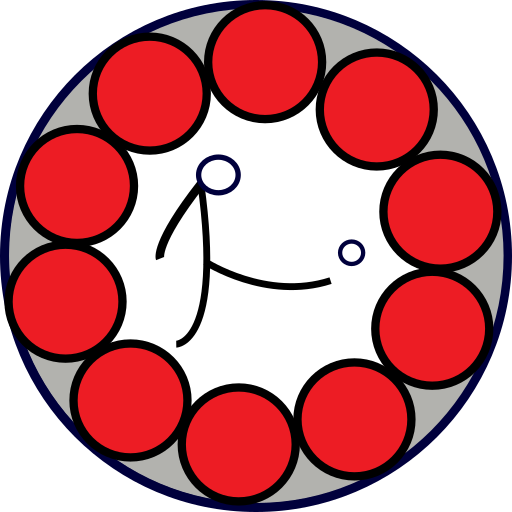

# Android Dice

|master|develop|
|:----:|:-----:|
|||

## Further Information

* [Changelog](https://gitlab.namibsun.net/namboy94/bundesliga-tippspiel-android/raw/master/CHANGELOG)
* [Gitlab](https://gitlab.namibsun.net/namboy94/bundesliga-tippspiel-android)
* [Github](https://github.com/namboy94/bundesliga-tippspiel-android)
* [Play Store Entry]()
* [Git Statistics (gitstats)](https://gitstats.namibsun.net/gitstats/bundesliga-tippspiel-android/index.html)
* [Git Statistics (git_stats)](https://gitstats.namibsun.net/git_stats/bundesliga-tippspiel-android/index.html)
* [Privacy Statement](app/resources/playstore/privacy_statement.txt)
