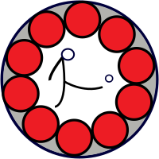

# Bundesliga Tippspiel (Android)

|master|develop|
|:----:|:-----:|
|||

An android-frontend for [hk-tippspiel.com](https://hk-tippspiel.com)
([bundesliga-tippspiel](https://gitlab.namibsun.net/namboy94/bundesliga-tippspiel)).

## Further Information

* [Changelog](https://gitlab.namibsun.net/namboy94/bundesliga-tippspiel-android/raw/master/CHANGELOG)
* [License (GPLv3)](https://gitlab.namibsun.net/namboy94/papio/raw/master/LICENSE)
* [Gitlab](https://gitlab.namibsun.net/namboy94/bundesliga-tippspiel-android)
* [Github](https://github.com/namboy94/bundesliga-tippspiel-android)
* [Play Store Entry](https://play.google.com/store/apps/details?id=net.namibsun.hktipp)
* [Git Statistics (gitstats)](https://gitstats.namibsun.net/gitstats/bundesliga-tippspiel-android/index.html)
* [Git Statistics (git_stats)](https://gitstats.namibsun.net/git_stats/bundesliga-tippspiel-android/index.html)
* [Privacy Statement](app/resources/playstore/privacy_statement.txt)
